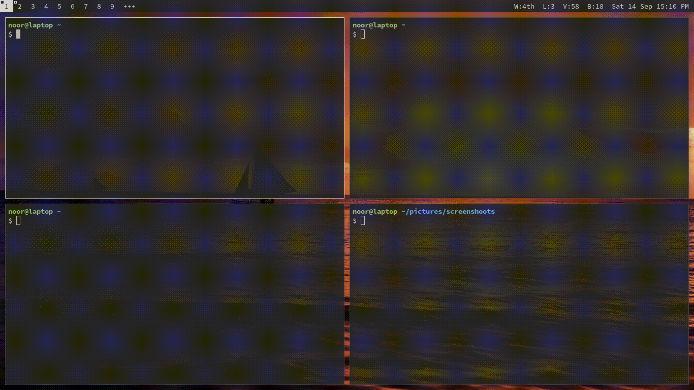
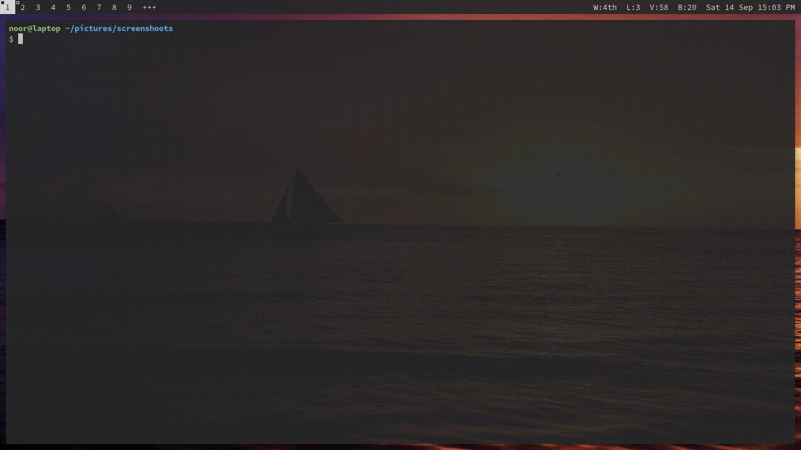

# DWM
## Highlighted Features
### Gaps
What are you looking for now days! I have modified all layout to have gaps its not like `gaps` or `uselessgap` that tried to change multiple things with one thing. I added each layout to have correct gapping behaviour like what I want. Even you could toggle the gap with `^P`.

If you are not meme person you can use `nogaps` branch that has no gaps code in it.

### Magic-Grid
Layout that always fill the space even though the number of windows are odd or prime. The binding for this layout is `^G`.

## Note
Note to use this build you have to use my [dotfiles](https://github.com/wachd/dotfiles) or you can change the binding for multimedia keys.
List patch installed:
- fakefullscreen
- movestack
- magicgrid
- noborder
- notitle
- pertag
- tilegap

Some are my direct modification that I really to lazy to create patch for. like `lineheight` in `config.h` for bar height.
